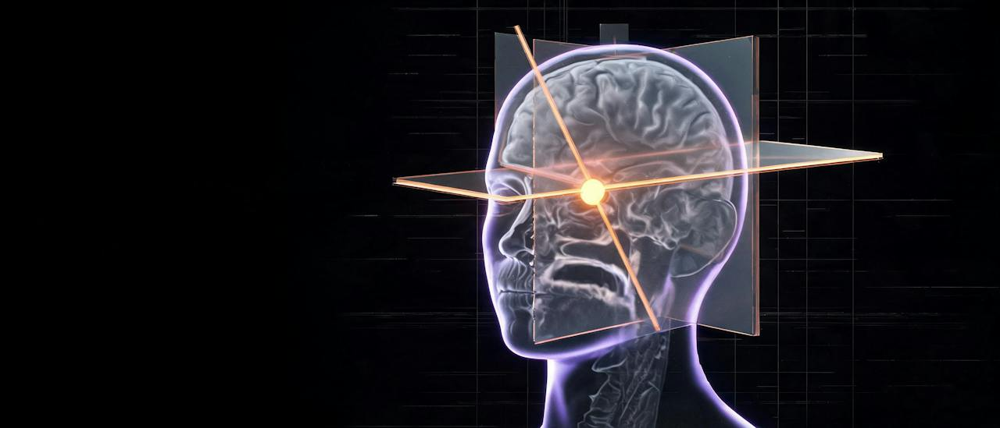

<p align="center">
  
</p>

<h1 align="center">OpenMRI</h1>

<p align="center">
  <b>A local viewer for your own MRI and CT studies.</b><br>
  Import the ZIP archive from the imaging centre and explore it in 3D and on three linked slices.<br>
  Everything runs on your computer. No image ever leaves it.
</p>

<p align="center">
  <a href="https://github.com/lev1nson/OpenMRI/actions/workflows/ci.yml"></a>
  <a href="LICENSE"></a>
  
  
  
  
</p>

<p align="center"><sub>The banner and the in-app intro clip are illustrations, not real scans.</sub></p>

---

## What it does

|                         |                                                                                                                                                              |
| ----------------------- | ------------------------------------------------------------------------------------------------------------------------------------------------------------ |
| **3D volume rendering** | Three palettes, a movable cut plane, and the slice planes drawn inside the volume.                                                                           |
| **Three linked slices** | Click a slice to place a focus marker that stays visible through the volume. Scroll to move through the stack.                                               |
| **Compare two series**  | Two series of one study side by side, with cursors linked in physical millimetres.                                                                           |
| **Patient library**     | Several patients and study dates in a local SQLite catalogue, with a cache of prepared NIfTI volumes.                                                        |
| **Focus over time**     | Mark a region on one date; other dates of the same head MRI are rigidly registered to it. Compare side by side, with a wipe, or by blinking between A and B. |
| **Welcome screen**      | Your five most recent studies one click away, next to the import wizard. Opening a study plays a short transition while the volume loads.                    |
| **Snapshots**           | PNG snapshots of the current view, saved into your data directory.                                                                                           |

OpenMRI is a visualization tool. It does not detect, measure, or diagnose anything.

## Requirements

- macOS or Linux. Windows works through WSL.
- [Node.js](https://nodejs.org) 22.13 or newer.
- Python 3.12, 3.13, or 3.14. On macOS: `brew install python@3.12`.
- A browser with WebGL 2.

The DICOM converter `dcm2niix` is installed automatically into the project's Python
environment by `npm run setup`.

## Quick start

Each way below installs OpenMRI on your computer, loads an anonymised demo
study, and opens the app in your browser. Click Jane under Recent studies to
open the study. The first run downloads about 1 GB and
takes a few minutes.

### Ask your AI coding agent

Paste this into Claude Code, Codex, Cursor, or any agent that can run commands
on your computer:

```text
Clone https://github.com/lev1nson/OpenMRI, follow its AGENTS.md to install
and start it with the demo study, and open it in my browser.
```

[AGENTS.md](AGENTS.md) gives the agent the exact steps.

### One command in the terminal

On macOS or Linux:

```sh
curl -fsSL https://raw.githubusercontent.com/lev1nson/OpenMRI/main/install.sh | bash
```

On macOS the script installs missing Node.js, Python, and Git with Homebrew,
and asks before installing Homebrew itself. On Linux it lists what to install
first. The app goes into `~/OpenMRI`. Run the same command again to update.

### By hand

```sh
git clone https://github.com/lev1nson/OpenMRI.git
cd OpenMRI
npm run demo    # install, build, start in the background, load the demo, open the browser
```

`npm run demo` runs the individual steps for you: `npm ci`, `npm run setup` for
the Python environment with pydicom, nibabel, SimpleITK, and dcm2niix, and
`npm run build`. On macOS you can also double-click `Launch OpenMRI.command`,
which runs the server in a Terminal window instead.

### Starting and stopping

```sh
npm run up       # start in the background and open the browser
npm run down     # stop
npm run status   # running or not, with the log location
```

The server listens only on `127.0.0.1`. It is a single-user desktop app with no
login, so do not expose the port to a network.

## The demo study

`demo/jane-head-mri.zip` holds one anonymised head MRI session: 18 series,
about 41 MB. `npm run demo` loads it as patient Jane. To load it by hand, click
**Import MRI**, choose that file, name the patient **Jane**, and click
**Prepare the study**. The face has been removed and the headers carry no
personal details; [demo/README.md](demo/README.md) describes the series and how
the data was anonymised.

## Importing your scans

1. Click **Import MRI** and choose a ZIP archive up to 2 GB. It can contain DICOM
   files in any folder layout, or `.nii` / `.nii.gz` files.
2. OpenMRI extracts the archive, reads the DICOM headers, and shows what it found:
   patient details from the headers, study dates, and the series.
3. Create a new patient or add the study to an existing one, then click
   **Prepare the study**. Conversion runs in the background; you can close the
   wizard and come back through **Library**.
4. Open the study. Volumes are cached, so later opens are instant.

Each archive must contain a single patient. Several study dates in one archive are
fine. Scalar 3D volumes and ordinary 2D MR/CT slice stacks are converted. 4D time
series, single images, color secondary captures, PDFs, and nested ZIPs are skipped
and listed as warnings. See [docs/getting-started.md](docs/getting-started.md) for
the import pipeline, the storage layout, and every viewer control.

## Where your data lives

Everything is stored under `.openmri/` next to the app. Set `OPENMRI_DATA_DIR` to
move it.

| Path             | Contents                                              |
| ---------------- | ----------------------------------------------------- |
| `library.sqlite` | Patients, studies, series metadata, import jobs       |
| `sources/`       | Original ZIP archives, named by SHA-256               |
| `volumes/`       | Prepared NIfTI volumes, downsampled to ≤320 px/axis   |
| `registrations/` | Rigid transforms and resampled volumes for comparison |
| `jobs/`          | Import drafts and worker logs                         |
| `captures/`      | PNG snapshots you saved                               |

`.openmri/` and `.venv/` are ignored by Git. Never commit the data directory.
It contains medical images and personal details.

## Development

```sh
npm run dev          # dev server on 127.0.0.1:4173
npm run lint         # oxlint
npm run typecheck    # tsc
npm test             # Node tests: focus controller, slice planes, timeline service, contracts
npm run test:import  # Python tests: ZIP import, real dcm2niix conversion, registration
npm run format       # oxfmt
npm run check        # lint, typecheck and the Node tests together
```

The Python tests generate synthetic DICOM and NIfTI data. One of them imports the
anonymised demo archive end to end.

## Project layout

```
app/                      served by vinext, Next.js style
  library-workspace.tsx     patient library, import wizard, screen switching
  welcome.tsx               welcome screen with recent studies
  intro.tsx                 entering transition played over the loading viewer
  viewer.tsx                main viewer: 3D volume and three slices
  focus-controller.ts       focus marker, smooth slice navigation, linked panes
  slice-planes-controller.ts  slice planes drawn inside the 3D volume
  compare-pane.tsx          second series with a linked cursor
  focus-timeline.tsx        registration and comparison across dates
  timeline-volume.tsx       NiiVue instance used by the timeline
  api/                      local HTTP API: library, imports, assets, timeline, captures
lib/
  library.ts                SQLite catalogue, data directory, worker launcher
  timeline-server.ts        regions, registrations, review logic
  focus-timeline.ts         shared geometry helpers and types
  recent.ts                 ordering of the recent-studies list
  dates.ts                  date formatting
  analysis-contract.ts      adapter interface for a future local analysis model
scripts/
  setup.mjs                 creates the Python environment
  demo.mjs                  loads the demo study through the local API
  server.sh                 start, stop, restart, status, logs for the local server
  import_mri.py             ZIP inspection and DICOM/NIfTI conversion worker
  register_mri.py           rigid registration worker, SimpleITK
tests/                    Node and Python tests
demo/                     anonymised demo study (Jane) as an importable ZIP
install.sh                one-line installer for macOS and Linux
AGENTS.md                 setup steps and rules for AI coding agents
docs/                     user guide and the registration feature description
public/welcome/           welcome background and intro clip (generated illustrations)
components/ui/            the few shadcn and base-ui primitives the app uses
```

Rendering is done by [NiiVue](https://niivue.com), DICOM conversion by
[dcm2niix](https://github.com/rordenlab/dcm2niix), registration by
[SimpleITK](https://simpleitk.org).

## Limitations

- Automatic registration is offered for head MRI only: DICOM body part `HEAD` or
  `BRAIN`, or NIfTI imports, which carry no body part. Other body parts import and
  display normally but cannot be compared across dates yet.
- Registration is rigid, rotation and translation only. It is an initial estimate,
  not a clinically validated alignment. Always check landmarks yourself.
- Series within one study share scanner coordinates. Motion between series is not
  corrected.
- Contrast tags come from DICOM metadata only. OpenMRI never infers contrast from
  image brightness and does not compute difference maps.
- No analysis model is connected. `lib/analysis-contract.ts` defines the adapter
  interface a local model would have to satisfy.

## Contributing and security

Pull requests are welcome; [CONTRIBUTING.md](CONTRIBUTING.md) has the setup and
the checks. Never attach real scans or patient details to an issue. Report
vulnerabilities privately as described in [SECURITY.md](SECURITY.md).

## License

[MIT](LICENSE). Dependencies keep their own licenses, among them NiiVue
(BSD-2-Clause), SimpleITK (Apache-2.0), nibabel (MIT), and dcm2niix, whose terms
ship with that package.
